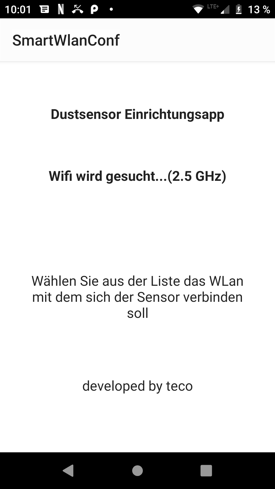
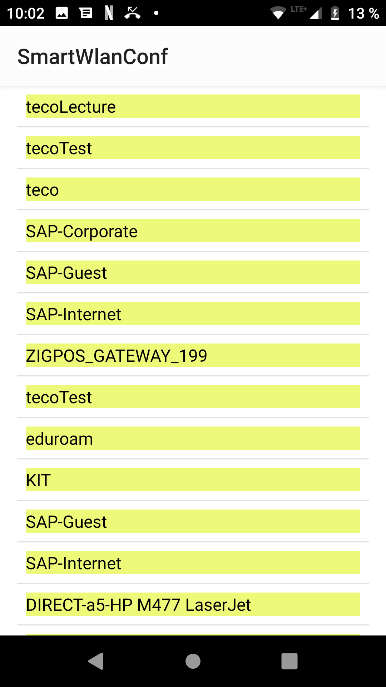
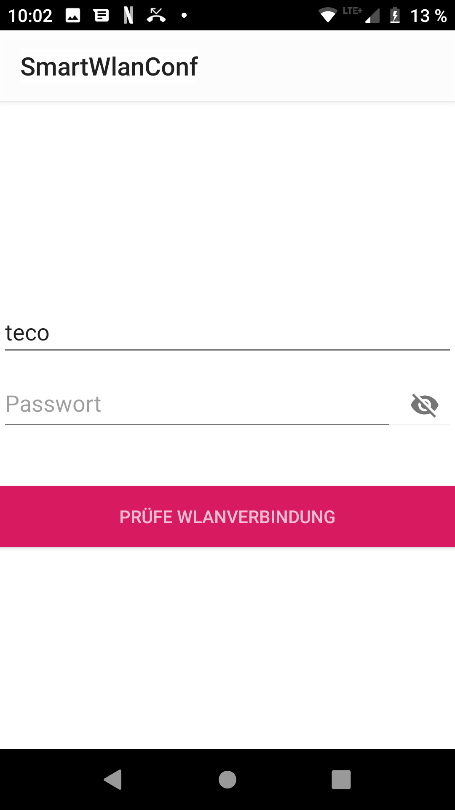
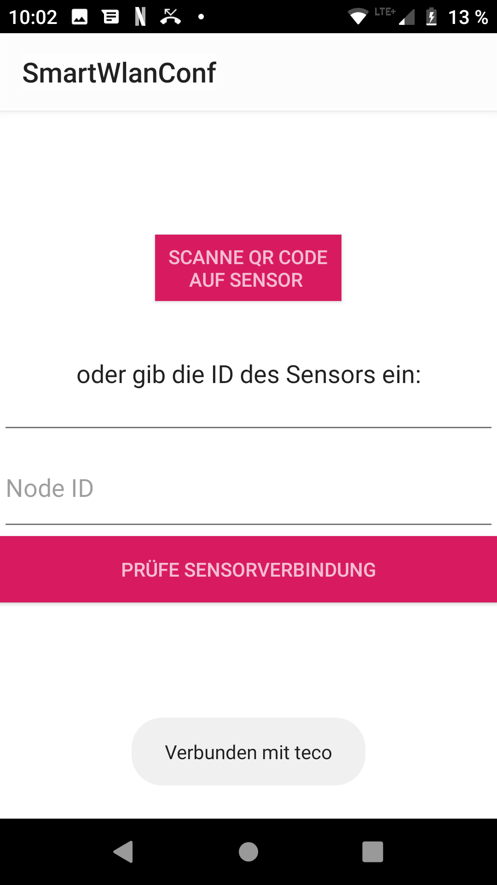

# CrowdsensorConfig

CrowdsensorConfig is an android app used to configure a stationary crowdsensor of SmartAQNet in a users wifi. 

CrowdSensorConfig first looks for available wifis and lists them on screen.

The user selects his wifi by clicking on the appropriate list entry.

He then has to enter the credentials of the selected wifi.

After that the application connects to the wifi of the user. The crowdsensor opens it's own wifi with his id as ssid. When CrowdsensorConfig is connected to the wifi, he asks the user to enter the id of the sensor, or to scan the QR code on the sensorsscreen.

The application then tries to connect to the sensors wifi.

By successful connection the app sends the wifi credentials to the sensor, which then reboots to connect to the users wifi.

When the sensor is restarted, the app tries to find the sensor in the user's wifi by it's mDNS adress "NodeID.local"

When the app is able to find the senor, it opens up the sensors configuration page in an external browser window.
