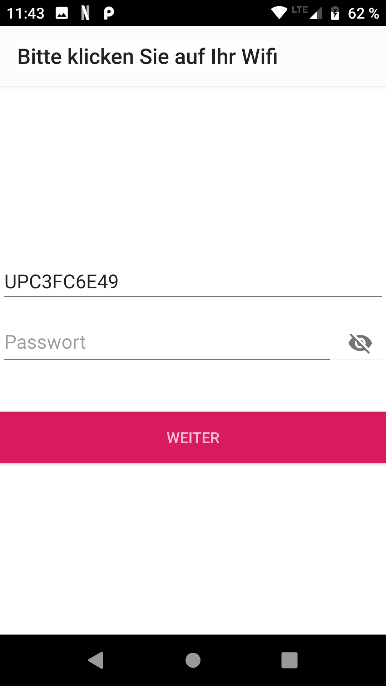

# CrowdsensorConfig

CrowdsensorConfig is an android app used to configure a stationary
crowdsensor of SmartAQNet in a users wifi.

CrowdSensorConfig first looks for the wifi provided by the
sensor.available wifis and lists them on screen.

If there are several sensors available the sensors are shown in alist.
The user selects his sensor by clicking on the appropriate list entry.

Next step the app looks for available wifis and shows the result in a
list. The user selects his wifi by clicking on the appropriate list
entry.

The user shall then enter the password for the selected wifi and
click on continue.

After that the application does several succesive steps. First it tries
to connect to the sensor's wifi and send the wifi credentials to the
sensor via HTTP, which is then restarted. It then reconnects to the
user's wifi and starts to look for he sensor in the user's wifi by it's
mDNS adress "SensorID.local". If the sensor is found,the app starts an
external browser which shows the sensors webpage.

What can go wrong?

If the user provided the wrong password for his wifi, the app asks him
to reenter his password and continues again from there.

It may happen that the app doesn't find the sensor in the user's wifi
although he is available. In that case it asks the user to look on the
sensor's screen for the IP-adress given to the sensor by the router and
enter it.

The app checks the IP-adress and then continues by starting an
external browser, which shows the sensors webpage.

Known issues:

Looking for wifis and sensors is not very reliable. It may sometimes
happen that the app doesn't find any wifi or sensor. In most cases it
helps to just wait for some seconds and then hit retry. If that doesn't
help just restart the app.
